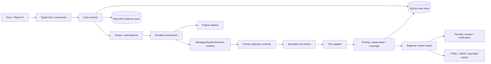

# ai-security-scanner 完整開發交接筆記

狀態日期：2026-09-12（America/New_York）

功能檢視基線：`9f1f5703c15bff3ae4213ba3a09dd3b3ea3898c0`

報告與匯出章節（§8.4、§12.3、§16 P1-1）另行對照 `d7d2652` 重新查證；其餘章節仍停在上列基線，未逐條重看。

專案：[GitHub repository](https://github.com/teddashh/ai-security-scanner) · [雙語專案網站](https://teddashh.github.io/ai-security-scanner/?lang=zh-TW)

產品行為唯一依據：[產品規格](product-spec.md)

目前能力摘要：[產品檢視](product-audit.md)

> 這份文件是開發交接與現況導航，不是新的產品規格、發布核准、合規聲明或安全保證。若本文件、架構文件、歷史 release 文件或程式碼註解與產品規格衝突，以產品規格為準，並把衝突視為待修正缺陷。

## 1. 給接手者的最短摘要

`ai-security-scanner` 是以 Tauri、React 與 Rust 建立的 local-first 桌面產品。使用者可把 repository、網站與已獲准的內部系統放進同一個 IT 環境專案，按一次 Start，讓產品為每個資產選擇適用的上游掃描器，最後取得一份依資產整理、依優先順序呈現的統一報告。

目前最重要的事實如下：

- 引擎目錄有 21 個已整合上游工具；CLI readiness 顯示 21/21 的 adapter 已載入、版本相符、可派送且無 admission blocker。
- 21 個工具都有對應的 native-output fixture 與 adapter；2026-09-11 執行 `adapter_fixtures` 共 92 項測試，全部通過。
- 所有工具共用同一個 finding、inventory observation、coverage、evidence 與 beginner report 流程；不存在「目錄列為已整合，但沒有 report adapter」的工具。
- CloudQuery、Steampipe、Naabu、httpx、Syft 的主要輸出是盤點、服務觀察或 SBOM，不是漏洞 finding；它們仍會進入統一報告的正確區塊。
- App 內 Results 頁已有成熟、雙語、響應式的視覺層級；主要問題、受影響資產、問題瀏覽器、證據與分享入口清楚。
- 可分享 HTML 的資訊架構完整，已有封面、執行摘要、列印分頁與頁首頁尾；仍缺圖表與和 App 一致的色彩語言，產品端也還沒有自己的 PDF 產生器。
- 英文與繁體中文是第一級語言；目前有大量跨 Rust／TypeScript 的文案與欄位 parity 測試。
- GitHub Pages 雙語介紹頁已上線，列出 21 個工具、官方 GitHub 連結、用途與有日期的 Star 快照，並明確強調結果會整理成一份報告。
- 目前 checkout 的產品資料目錄沒有實際 case；測試與 demo 可以證明契約及畫面，不能替代 21 個工具在今天全部完成 live end-to-end 掃描的證據。
- 下一個最有價值的產品驗收不是再增加工具數量，而是用受控、明確授權的資產完成 installed desktop 的 mixed IT-environment 實跑：Setup → Review → Progress → terminal Results → reopen → HTML export。

## 2. 狀態用語：避免把不同成熟度混在一起

後續文件、issue、PR 與報告應使用下列區分：

| 狀態 | 精確意思 |
| --- | --- |
| 已實作 | 程式碼路徑存在；不自動代表可發布、已實跑或使用者能順利完成。 |
| 已整合 | catalog、固定輸入、launcher／command、adapter 與輸出契約存在。 |
| 可派送 | 目前 registry/admission 判定該 engine coordinate 可建立工作。 |
| 已用 fixture 驗證 | 固定上游格式樣本能被解析並保留語意；不是 live scanner 證據。 |
| 已在瀏覽器 demo 呈現 | React 畫面與資料投影可檢查；demo 不接觸 target。 |
| 已在實際引擎執行驗證 | 固定上游 scanner 確實對受控輸入執行並產生保存結果。 |
| 已在安裝版驗收 | 使用公開安裝檔完成真實使用者路徑、保存、重開與匯出。 |
| 已準備但未啟用 | 新 source／launcher 已存在，但現行 catalog 仍指向較早的 immutable image digest。 |
| 發布歷史 | 只描述既有 tag/artifact，不代表下一版工作已獲核准。 |

「測試通過」、「程序結束」、「runtime ready」、「TCP port 開啟」都不等於「完成弱點掃描」。第一個有意義的結果必須來自真正安全、弱點、秘密、相依套件或設定檢查，或者誠實保留已完成 sibling 結果並清楚指出未測試範圍。

## 3. 不可偏離的產品方針

### 3.1 首要使用者與價值

主要使用者是 Windows 上不熟 scanner、container、WSL 或資安術語的 IT generalist、developer 或小型企業使用者。產品首先要幫他回答：

1. 我選了哪些 repository、網站、內部主機或其他資產？
2. 每個資產實際跑了哪些安全檢查？
3. 哪些資產有問題？先處理什麼？
4. 問題可能造成什麼影響？
5. 最小可行下一步是什麼？如何驗證修正？
6. 哪些工作沒有執行、失敗、逾時或不適用？

### 3.2 主要流程

首頁只需領導三條短路徑：

- **掃描我的 IT 環境**：多個 repository、網站與精確內部 host 放在一輪。
- **檢查網站**：一個完整 `http://` 或 `https://` URL，執行經審查的 Nuclei quick profile。
- **檢查專案資料夾**：選擇一個本機資料夾，掃描唯讀 snapshot。

Cloud、IaC、container、Kubernetes 與其他來源是 secondary／Advanced，不應增加不相關 beginner flow 的步驟。localhost TCP connection test 是診斷工具，不是主掃描入口。

### 3.3 上游優先、adapter 薄層

上游 scanner 負責：

- detector 行為；
- rule／template／OID／check ID；
- 原始 severity；
- 原始 evidence；
- 原始 remediation。

產品 adapter 只負責：

- 把已授權的 typed input 交給 scanner；
- 限制 scope、mount、egress、resource、timeout 與 cancellation；
- 保存 raw artifact；
- 解析固定格式；
- 正規化結構，不改寫 finding 的原意；
- 把 partial、failed、timed-out、cancelled、not-tested 狀態保留下來。

產品共同 report layer 負責：

- 依資產呈現；
- 優先排序；
- 去重與跨引擎關聯；
- 白話 impact／next action／verification；
- localization；
- 統一報告與匯出。

不要在 wrapper 重建 detector，不要因為想讓畫面整齊而改 severity、隱藏 finding、把 inventory 轉成 vulnerability，或把 parser error 轉成零問題。

### 3.4 報告終態

目前產品規格明確要求：

- active work 只留在 Progress；
- Results 與 Export 只使用 terminal run；
- 不提供 live/interim report；
- terminal incomplete report 要保留已完成 sibling 結果；
- formal terms 放最後，technical evidence 預設收合。

若其他文件仍寫著「第一個 durable result 出現後立即開啟持續更新的 report」，那是歷史描述，不是目前行為。

### 3.5 Owner 邊界

版本分類、release timing、packaging、signing、publication、certification 與 compliance posture 都由 product owner 決定。除非 owner 在當前任務明確要求，普通產品或掃描器工作不可自行擴大到這些範圍。

## 4. 目前完成的使用者旅程

| 階段 | 現行行為 | 交接注意事項 |
| --- | --- | --- |
| Home | 主推 IT environment、website、project folder；Advanced 與 localhost utility 次要。 | 卡片要描述成果，不要用 scanner 名稱主導。 |
| Setup | 可重複加入 folders、完整 URLs、精確 host/IP；internal host 有 common-port defaults。 | 表單驗證不應接觸 target。 |
| Review | 依資產類型分組、顯示精確 target、適用安全檢查、時間與主要限制，一個 Start。 | network scope 在這裡凍結。 |
| Progress | 顯示 active asset/check、問題數、完成／剩餘／需處理項目、時間、取消與重試。 | scanner log 與 runtime jargon 收合。 |
| Results | 只在 terminal run 顯示一份統一報告；每個資產有一個誠實狀態。 | observation 與 vulnerability 必須分開。 |
| Reopen | 由保存事實重建同一輪報告。 | 不可借用 current case 的可變資料覆蓋歷史 run。 |
| Verification | compatible rescan 分成 new、persistent、resolved、unverifiable。 | 沒跑的 check 不能被標成 resolved。 |
| Export | 由同一 terminal report model 產生 HTML、JSON 與 specialist formats。 | active run 不可匯出假報告。 |

### 4.1 IT environment

一個專案可同時包含：

- 多個 repository folder；
- 多個完整 website/API URL；
- 多個精確 hostname 或 IP 的 internal system。

每個 internal system 預設 ports 是 `22, 23, 25, 80, 443, 445, 3389, 5900, 8080, 8443`。Advanced 可用最多 64 個精確 ports 取代預設值；不可用 CIDR、range、URL、credential 或鄰近 host 偷偷擴大 active target。

每個 engine 只收到自己的 asset IDs。某個網站、主機或 scanner 失敗，不會刪除已完成 repository 或其他網站的結果。

### 4.2 Website/API

Quick path 使用 pinned Nuclei automatic scan：

- scope 是一個精確 `scheme://host:port` origin；
- 使用者輸入的 path 保留為 context，但適用 template 可以請求同 origin 的其他 path；
- 上游 Wappalyzer／technology detection 決定適用 template；
- template pool 是固定、唯讀、安全篩選後的 upstream snapshot；
- 不 authenticate、不送 form/body、不 follow redirect、不 OOB、不 headless、不 upload、不 credential attack、不 DoS。

Nuclei non-match 只有在輸出包含可靠 execution evidence 時才能支持 completed no-finding。空 JSONL、scanner error 或 malformed record 不可變成 clean scan。

### 4.3 Repository

產品建立有界、私密、唯讀 snapshot，再視適用情況執行：

- Gitleaks、TruffleHog：secret pattern；
- Semgrep：risky code pattern；
- Trivy、Grype：recognized dependency vulnerability；
- Checkov、KICS：IaC／deployment／configuration；
- Syft：component inventory／SBOM。

原始專案不會被 build、execute、upload、commit、push 或修改。snapshot 遵守 repository ignore rules 排除 dependency、build、cache、VCS 與 generated directories，但 `.env` variants、private keys、registry/auth config、`*.tfvars` 等常見 secret-bearing source files 仍交給 secret scanners。

缺少支援的 manifest、language 或 IaC file 是 coverage limit，不是安全通過。

### 4.4 Internal system

Generic host profile 使用 Greenbone：

- 只掃精確確認的 host 與 ports；
- feed 選 current、non-deprecated、unauthenticated remote `gather_info` VTs；
- Greenbone 自己做 service/product detection、dependency 與 required-key/port applicability；
- 排除 local authenticated checks、brute force、default account、policy families、alternate port scanners、attack、denial、destructive、kill-host、flood；
- `alarm` 才是 vulnerability finding；
- `error`／`dead_host` 是 incomplete coverage；
- `log` 是 technical evidence；
- 無 upstream severity 的 alarm 保持 Unknown。

Naabu 與 httpx 可以準備 service/reachability evidence，但 open port 或 HTTP response 本身不是 vulnerability。

### 4.5 Cloud 與 Microsoft 365

這些路徑需要官方登入或隔離的 administrative bootstrap，並綁定單一 case、source、provider coordinate、engine set、expiry 與 checkout ceiling。credential 是 process-memory-only，不進 SQLite、artifact、CLI argument 或聊天內容。

目前主要 scope：

- AWS：CloudQuery、Steampipe、Prowler、ScoutSuite、Cloudsplaining；
- Azure：Prowler 的單一 enabled subscription、窄 IAM profile；
- GCP：Prowler 的單一 active project、四項 IAM checks；
- Microsoft 365／Entra：ScubaGear、Maester 的單一 tenant profile。

Cloud profiles 目前以 IAM／identity／configuration 為主，不可宣稱是完整 cloud security assessment。

### 4.6 Container、IaC 與 Kubernetes

- Container 接受 backend 驗證過的 single-image OCI layout，不接受任意 registry pull 或執行中的 workload。
- Trivy、Grype 產生 vulnerability finding；Syft 產生 SBOM inventory。
- Kubescape 掃 local Kubernetes YAML／JSON manifest snapshot，不連 live cluster。
- kube-bench 掃 immutable node-configuration snapshot，不 privileged-mount live host。
- IaC working tree 由 Checkov、KICS 與適用的 Trivy profile 處理。

### 4.7 Localhost utility

localhost TCP utility 只做一次 payload-free connection attempt，回答 accepted、refused 或 timed out。它不能產生 vulnerability finding，也不能算 first meaningful scan value。

## 5. 系統與資料流



關鍵順序：

1. 先保存 case revision、requested scope、authorization 與 engine-to-asset tasks。
2. 再做 runtime、gateway、image、credential 與 execution preflight。
3. 每個 task 獨立完成、partial、failed、timed-out、cancelled 或 not-tested。
4. raw output 先以 bounded artifact 保存，再由 adapter 正規化。
5. report 從 durable facts 建立，不從 transient UI event 猜結果。
6. export 與 reopen 使用同一 report model。

Event 只是 refresh hint。startup、focus、resume、watchdog 與重要事件之後都應讀 authoritative persisted state；晚到的舊 response 不可覆蓋較新的 case/run state。

## 6. 目前實體程式碼地圖

架構文件中的 `crates/case-domain`、`crates/orchestrator` 等名稱是邏輯邊界描述；目前 repository 實際只有一個 Rust workspace member：`src-tauri`。不要假設那些 `crates/*` 實體目錄存在。

| 路徑 | 目前責任 |
| --- | --- |
| `src/App.tsx` | App state、authoritative refresh、page routing、native/demo 區分與主要 action orchestration。 |
| `src/pages/StartPage.tsx` | 三條 beginner paths 與 secondary options。 |
| `src/pages/CasesPage.tsx` | 建立、選擇、保存、刪除與重新開啟 scan projects。 |
| `src/pages/CoveragePage.tsx` | Setup、Review、asset selection、scope 與 Start。 |
| `src/pages/ProgressPage.tsx` | Active/paused/terminal execution presentation。 |
| `src/pages/FindingsPage.tsx` | 統一 Results、priority、asset summary、finding browser 與 evidence detail。 |
| `src/pages/ExportPage.tsx` | terminal-run export options、preview 與 integrity verification。 |
| `src/pages/VerificationPage.tsx` | baseline/rescan diff presentation。 |
| `src/services/scanner.ts` | Typed frontend service、Tauri commands、browser demo boundary。 |
| `src/services/nativeAdapter.ts` | Rust IPC response 到 TypeScript model 的轉換。 |
| `src/styles.css` | 主要 App／Results 視覺、responsive 與 accessibility styling。 |
| `src-tauri/src/case_service.rs` | Case lifecycle、planning、scan、report persistence、HTML/JSON export 的主要協調層。 |
| `src-tauri/src/orchestrator.rs` | Durable task/attempt lifecycle、execution outcomes、recovery。 |
| `src-tauri/src/registry.rs` | Engine catalog admission、provider/input compatibility。 |
| `src-tauri/src/adapters/mod.rs` | 21 個 built-in adapters 與 native output extraction。 |
| `src-tauri/src/beginner_report.rs` | Terminal beginner master report、asset outcome、coverage 與 next steps。 |
| `src-tauri/src/correlation.rs` | Cross-engine correlation suggestions，不刪 canonical findings。 |
| `src-tauri/src/prioritization.rs` | Shared transparent ordering factors。 |
| `src-tauri/src/storage.rs` | SQLite persistence 與 durable state。 |
| `src-tauri/src/artifact_store.rs` | Case-scoped content-addressed evidence storage。 |
| `src-tauri/src/workspace_snapshot.rs` | Bounded local read-only snapshot。 |
| `src-tauri/src/external_scope.rs` | Exact external/internal target parsing與 scope freeze。 |
| `src-tauri/src/source_authorization/*` | Provider authorization、capabilities 與 live discovery。 |
| `src-tauri/src/managed_runtime.rs` | Managed runtime generation、repair、ownership、resume。 |
| `src-tauri/src/runtime.rs` | Managed、Docker、Podman provider selection。 |
| `engines/catalog.json` | 21 個可執行 engine coordinates、版本、digest、scope、format、knowledge/support dates。 |
| `engines/images/*` | Engine Dockerfiles、plans、launchers、patches、offline data preparation。 |
| `engines/upstreams.lock.json` | Upstream source pins。 |
| `mappings/control-mappings.json` | Optional NIST/ISO/AIDEFEND `related` mappings。 |
| `tests/frontend` | Pure data/presentation/contract tests。 |
| `tests/component` | Rendered React behavior。 |
| `src-tauri/tests` | Adapter、case lifecycle、execution、authorization、snapshot 與 storage integration tests。 |
| `.github/workflows/ci.yml` | Changed-boundary classifier 與 CI lanes。 |

## 7. 21 個整合工具的真實狀態

以下版本與狀態來自 2026-09-11 的 `engines/catalog.json`。`default` 表示一般 local-artifact compatibility 的 catalog default，不代表每次掃描都會執行；planner 仍須依 asset kind、input profile、provider 與 authorization 判斷。

| Engine | Catalog 版本 | 輸入／provider | 統一報告角色 | 重要界線 | 狀態 |
| --- | --- | --- | --- | --- | --- |
| CloudQuery | `2.0.31-aws9.2.0-file1.0.2` | AWS cloud account | IAM inventory observation | 最後完整公開 source closure；不是目前商用 plugin | 已整合、可派送，但知識日期 2023-01-10，已超過 support window |
| Steampipe | `2.4.5` | AWS cloud account | IAM user inventory observation | policy-shaped columns 不轉成 finding | 已整合、可派送 |
| Prowler | `5.39.1` | AWS account、Azure subscription、GCP project | configuration findings | 每次一個精確資產；Azure/GCP 使用窄 profile | 已整合、可派送；有六個 hash-bound downstream patches |
| ScoutSuite | `5.14.0` | AWS cloud account | IAM configuration findings | reduced AWS IAM assessment，不是完整 ScoutSuite | 已整合、可派送 |
| Cloudsplaining | `0.9.1` | AWS cloud account | excessive-permission findings | 只分析 bounded IAM authorization details | 已整合、可派送 |
| ScubaGear | `1.8.0` | Microsoft 365 tenant | configuration findings／unknown states | fixed AAD baseline，保留 upstream unknown | 已整合、可派送 |
| Maester | `2.0.0` | Microsoft 365 tenant | findings 與 no-verdict/manual-review controls | fixed Graph-only profile | 已整合、可派送；新版 Investigate wrapper 尚未由現行 image 啟用 |
| Naabu | `2.6.1` | exact IP/host/domain + selected ports | service/port observation | open port 不是 vulnerability | 已整合、可派送 |
| httpx | `1.10.0` | domain/IP/web service | HTTP observation | reachability/status metadata，不是 vulnerability scanner | 已整合、可派送 |
| Nuclei | `3.11.1` | exact website origin | vulnerability/exposure findings + execution evidence | 4,674 個 bounded read-only candidates；不 crawl/auth/OOB/DoS | 已整合、可派送 |
| Greenbone | `23.50.21` | exact host + ports | vulnerability findings、logs、incomplete target results | unauthenticated remote-safe profile | 已整合、可派送；typed-result launcher source 尚未由現行 image 啟用 |
| Semgrep | pinned source `a0c13f…` | repository snapshot | code findings | 1,620 個 upstream security rules、31 language IDs | 已整合、default、可派送 |
| Gitleaks | `8.30.1` | repository snapshot | secret findings | 一般呈現遮蔽 secret value | 已整合、default、可派送 |
| TruffleHog | pinned source `3ab759…` | repository snapshot | unverified secret findings | filesystem only、`--no-verification`、無 engine network | 已整合、default、可派送 |
| Checkov | `3.3.13` | repository/IaC snapshot | configuration findings | upstream `all` framework detection、外部整合停用 | 已整合、default、可派送 |
| KICS | `2.1.20` | repository/IaC snapshot | configuration findings | digest-pinned upstream image/query pack | 已整合、default、可派送 |
| Trivy | `0.74.0` | repository/IaC/OCI layout | dependency/OS vulnerability findings | offline DB；現行 profile 有刻意排除項目 | 已整合、default、可派送；新 JAR source profile 尚未由現行 image 啟用 |
| Grype | `0.117.0` | repository/OCI layout | dependency/OS/JAR findings | offline DB；`dir:` 與 `oci-dir:` typed input | 已整合、default、可派送 |
| Syft | `1.51.0` | repository/OCI layout | component inventory/SBOM | inventory 不是 vulnerability conclusion | 已整合、default、可派送 |
| Kubescape | `4.0.12` | local Kubernetes manifests | posture findings | offline framework；不連 live cluster | 已整合、default、可派送 |
| kube-bench | pinned source `9f133c…` | immutable node snapshot | CIS findings、unrated severity 保持 Unknown | 不 mount live host | 已整合、default、可派送；新完整 CIS source profile 尚未由現行 image 啟用 |

除 CloudQuery 外，表內現行 closure 的 catalog knowledge date 是 2026-08-24，support-until 是 2026-11-22。日期到期後不可只改日期；必須重新檢查 exact engine、rules、templates、feed、database、source、license 與 fixtures。

### 7.1 Adapter/report coverage

`src-tauri/src/adapters/mod.rs` 的 built-in registry 與 catalog 都固定為同一組 21 IDs。每個工具都有 fixture：

- JSON：Steampipe、ScoutSuite、Cloudsplaining、ScubaGear、Maester、Semgrep、Gitleaks、Checkov、KICS、Trivy、Grype、Syft、Kubescape、kube-bench；
- JSONL：CloudQuery、Naabu、httpx、Nuclei、TruffleHog；
- OCSF JSON：Prowler；
- XML：Greenbone。

Adapter 行為重點：

- known empty result shape 才能表示完整零 finding；
- malformed sibling 不刪除已解析的 valid findings，但會使結果 partial/incomplete；
- secret 與 target-controlled instruction 不得進入一般 finding prose；
- container mount path `/workspace` 不得顯示成使用者本機位置；
- upstream severity 存在就保留；不存在時保持 Unknown 或使用明確標示的 deterministic product basis；
- 同一 CVE 由 Trivy 與 Grype 回報時可提出單一 presentation row，但原 finding/evidence 仍獨立；
- inventory engine 不得進 vulnerability pipeline。

### 7.2 尚未支援任意第三方結果匯入

目前沒有「把任意 scanner 的 SARIF／JSON／XML 丟進 App，就自動成為完整報告」的通用 importer。不在 catalog 的工具沒有固定 engine identity、asset binding、execution outcome、scope、knowledge date、severity ownership 與 raw artifact contract，因此直接匯入會產生錯誤的 clean/coverage 推論。

若未來實作 importer，應從 bounded SARIF import profile 開始，最低要求：

1. 使用者選擇來源工具與明確 asset；
2. 保存原檔及 SHA-256；
3. 驗證 SARIF schema、tool identity、rule IDs、locations 與 result kinds；
4. 對缺少 execution/coverage metadata 的匯入標成 coverage unknown；
5. 沒有 result 絕不可推論 scanner 完整執行；
6. import adapter 有版本、fixture、size/path/symlink limits 與 malformed behavior；
7. 匯入 finding 可進共同 report，但不能自行取得 network authorization 或 scanner execution provenance。

## 8. 統一報告現況

### 8.1 單一模型

每個 terminal run 都產生同一個 beginner master report，供下列介面使用：

- Results；
- reopen；
- export preview；
- readable HTML；
- canonical JSON；
- verification/comparison；
- optional OCSF、OSCAL 與 framework exports。

每個 selected asset 只能得到四種 beginner-readable outcome 之一：

| 狀態 | 意義 |
| --- | --- |
| 發現問題 | 至少一個 security finding 影響資產。 |
| 已完成檢查未發現問題 | 明列範圍內至少一個 security-relevant check 完成且無 finding。 |
| 未完成或失敗 | 要求工作未完成；已完成 sibling 結果仍保留。 |
| 尚未測試 | 沒有適用 security check 完成。 |

Observed services、open ports、HTTP responses、cloud inventory 與 SBOM 使用不同 typed observation section，不進 problem count，也不取得 remediation workflow。

### 8.2 第一層內容

Results 第一層目前包含：

- 「Know what to fix first」／對應繁中 heading；
- Top priority cards；
- severity 與 confidence；
- affected target 與 location；
- impact；
- next action；
- verify the fix；
- affected-assets list；
- critical/high/open/asset metrics；
- finding browser、search 與 filters；
- expandable evidence/details；
- save/share report action。

### 8.3 視覺品質實測

2026-09-11 以 browser demo synthetic data 渲染：

- Desktop：1440×1200 與 1440×5000；
- Mobile：390×844 與 390×5000。

實際觀察：

- desktop 的深色 priority section、白色 asset/result cards、severity pills 與 lime CTA 層級清楚；
- mobile 轉成單欄，沒有橫向溢位，priority cards、assets 與 finding browser 依合理順序堆疊；
- 長報告在手機上自然很長，但資訊沒有被截斷；
- page-transition heading 的 focus outline 是 accessibility 行為，不是 scanner 狀態；
- demo 頂部明確標示 Preview only／Synthetic sample data，不能與 real result 混淆。

結論：App 內 report 已達到專業產品介面水準。這個視覺檢查只證明呈現，不證明 live scanner execution。

### 8.4 HTML export 的真實品質

Readable HTML 目前具備：

- project/run identity；
- terminal summary 與 task counts；
- asset outcomes；
- inventory/observations；
- requested、actually tested、not tested、next steps；
- ordered findings；
- collapsed technical details；
- report terms 與 redaction/integrity disclosure；
- responsive single-column media query；
- CSP 禁止 script、form 與 remote resources；
- 封面：case／run identity 與七格 KPI（問題數、已完成、部分完成、失敗、逾時、未測試、涵蓋缺口）；
- `@page` 列印版式：A4、頁首左為案件標題、右為 run id，頁尾左為聲明、中為時間戳、右為頁碼 `N / M`，首頁不加頁首；
- 列印分頁控制：`break-after:avoid`、`break-inside:avoid`、表頭跨頁重複（`display:table-header-group`）、帶色元素 `print-color-adjust:exact`；
- 每張表都有 `caption`，覆蓋矩陣格子同時帶圖示、可朗讀文字與 `title`。

目前 styling 是 system font、1080px content width、simple cards、borders、tables 與 status colors，主色為 `#123a63`。內容專業、結構完整、安全且可讀，列印輸出的頁面填充率已量測（除各報告最末頁外，最短的一頁到 649.6pt／可用高度約 785pt）。仍缺的是圖表、與 App 一致的 dark-teal／lime 色彩語言，以及產品端可控的 PDF 產生器。

不要宣稱 PDF 已實作。架構文件只把 `summary.pdf` 寫成「deterministic PDF generation available 時」的未來位置；目前主要 share format 是 HTML，PDF 只能由使用者自行用瀏覽器列印產生，產品不保證其決定性。

## 9. Project website 與 README 進度

功能 commit：`9f1f570 docs: add bilingual project website`

已完成：

- 更新英文 `README.md` 與繁中 `README.zh-TW.md`；
- 依 engine catalog 明列 21 個工具，不靠手動印象補清單；
- 每個工具連到官方 GitHub repository；
- 說明產品實際使用方式與限制；
- 強調「selected assets → applicable upstream tools → thin adapters → one prioritized report」；
- 明確區分 vulnerability、configuration、secret、inventory、observed service 與 SBOM；
- 新增 `docs/index.html`、`docs/project-site.css`、`docs/project-site.js`、`docs/project-mark.svg`、`docs/.nojekyll`；
- 新增英文／繁中切換，支援 `?lang=zh-TW`；
- 無第三方字型、remote script、tracker 或 remote image；
- 新增 `docs/tool-stars.json` 保存 GitHub REST API Star 快照；
- 新增 `tests/frontend/projectSite.test.ts`，驗證 catalog 的每個 engine 在 website 與兩份 README 都存在、Star 顯示與 snapshot 相符、資產均為 local、頁面 bilingual/responsive、package homepage 正確；
- `package.json` homepage 與 GitHub repository Website metadata 都指向 Pages；
- GitHub Pages 使用 `main` branch 的 `/docs`、legacy build、HTTPS enforced、public。

公開網址：<https://teddashh.github.io/ai-security-scanner/>

Star 快照：

- 取得時間：2026-09-10T23:15:00-04:00；
- 來源：GitHub REST API；
- 21 個 engine repos 加上 Nuclei Templates、Semgrep Rules；
- Star 是日期快照，不是 live counter；更新數字時要一起更新 `checkedAt` 並跑 site tests。

部署驗證：

- Pages run `34559038698`：success；
- public page 回應 HTTP 200；
- 部署後 HTML、CSS、JS 曾與 local committed files 做 SHA-256 比對，一致；
- GitHub 的 legacy Pages action 曾出現 GitHub-owned `upload-artifact` Node 20 deprecation warning，但部署成功，且不是 repository 自寫 workflow 的 runtime failure。

## 10. Runtime、隔離與資料安全

### 10.1 Runtime providers

支援的 provider abstraction：

- `managed_local`：一般安裝版的自動準備路徑；
- `docker`：Advanced／development compatibility；
- `podman`：Advanced／development compatibility。

Windows managed runtime 使用 WSL 2 內的 rootless Podman machine；Linux 使用 QEMU/Podman；macOS 使用 AppleHV/vfkit/Podman。這些是實作方式，不應成為 beginner setup vocabulary。

### 10.2 核心安全界線

- UI 不直接接 Docker/Podman socket；
- engine 不 mount runtime socket 或 broad home directory；
- local input 是 read-only snapshot；
- writable output 只在 bounded job directory；
- command 不使用 shell interpolation；
- image、rules、templates、feed、DB 與 helper 以 digest/checksum pin；
- runtime generation 有唯一 identity 與 durable ownership proof；
- 名稱相似不代表產品擁有，ambiguous runtime/storage 一律保留；
- cleanup 只處理 exact verified product-owned object；
- credential 不進 SQLite、artifact、log、chat、command args 或 product-created env files；
- network egress 依 task、target、port 與 provider endpoint allowlist 限制；
- output 有 file size、aggregate bytes、file count、depth、symlink、special-object limits；
- cancel 先停止新 dispatch 與 target contact，cleanup 可在背景繼續並留下 durable obligation。

### 10.3 2026-09-11 本機診斷快照

`ai-security-scanner-cli doctor` 顯示：

- engine manifests：21；
- release-approved engines：21；
- admission issues：0；
- Docker compatibility provider：available，Docker `29.5.2`；
- preferred provider：`managed_local`；
- 這個 checkout 的 managed-local payload：未安裝；
- default product data directory 的 case list：空。

不要把「Docker available」與「packaged managed runtime ready」混為一談；也不要把 runtime ready 當成 scanner 已執行。

## 11. 已準備但尚未由現行 image 啟用的工作

這四項最容易被誤報為「已上線」：

| 項目 | Source 已完成 | 現行 catalog/image | 啟用條件 |
| --- | --- | --- | --- |
| Trivy JAR | 已準備 checksum-pinned Java index 與 upstream DB path | catalog 仍是 published `0.74.0-3` | 需新的 immutable image coordinate 並更新 catalog |
| Greenbone typed results | launcher source 已區分 alarm/error/dead_host/log | 現行 image 仍包含較早 launcher | 需新的 immutable Greenbone image coordinate |
| kube-bench profile | source 已換成 unmodified upstream CIS 1.11 node profile、26 checks | catalog 仍是 `0.16.0-3` | 需新的 immutable image coordinate |
| Maester Investigate | wrapper source 已把 Investigate 保存成 no-verdict/manual review | 現行 published image 較早 | 需新的 immutable M365 image coordinate |

這些是工程狀態，不是要求立即發布。是否 build/publish/select 新 image 由 product owner 在當前任務明確決定。

## 12. 已知限制與未完成驗證

### 12.1 最高優先事實缺口

目前 repository、fixtures、CI 與 UI tests 很完整，但仍缺少一份以目前安裝版、目前 immutable images、受控且明確授權 assets 完成的 mixed real scan acceptance record，涵蓋：

1. 新安裝／首次工具準備；
2. 一個 repository；
3. 一個 website origin；
4. 一個 exact internal host + reviewed ports；
5. 一次 Start；
6. 至少一個真正 security-relevant upstream result；
7. 一個獨立 sibling failure 或 not-applicable 路徑；
8. terminal unified report；
9. app restart 後 reopen；
10. readable HTML export；
11. 記錄 time to first useful result。

沒有這份 evidence 前，不應宣稱「21 個工具今天在每個平台全部 live E2E 通過」。

### 12.2 Engine coverage 限制

- CloudQuery knowledge date 2023-01-10、support-until 2023-04-10，雖仍 dispatchable，但必須顯示 stale limitation 或選擇 replacement policy。
- Prowler Azure/GCP 不是 upstream general coverage；六個 downstream patches 增加長期維護成本。
- GCP 僅四項 IAM checks；擴大 checks 時 permissions、assets、endpoints、fixtures、copy 與 report coverage 必須一起決定。
- ScoutSuite 只做 reduced AWS IAM assessment。
- Nuclei 不做 authenticated workflow、crawl、form、OOB、headless 或侵入式測試。
- Greenbone 不做 authenticated patch inventory。
- Container 只接受 single-image OCI layout，不做 registry 或 live workload scan。
- Kubescape 與 kube-bench 是 snapshot-based，不是 live cluster/host scanning。
- TruffleHog verification 關閉；finding 不能宣稱 credential 已確認有效。

### 12.3 Report／integration 缺口

- 任意第三方 SARIF/JSON/XML import 尚未實作。
- Readable HTML 仍缺圖表與和 App 一致的色彩語言（封面、執行摘要、列印版式已完成，見 §8.4）。
- Deterministic PDF export 尚未實作；目前只能由瀏覽器列印。
- 尚未有對外的 engine readiness/requirement matrix，使用者可能把 21 個工具理解為全部一鍵執行。
- README 與 website 說明了工具用途，但仍可更明確標示「直接可用／需登入／需 snapshot／observation only／narrow profile」。

### 12.4 文件漂移

本節原先列出的兩處差異都已在 `8b25186`（晚於本文基線）修掉，於 2026-09-12 對照確認：

1. ~~`docs/architecture.md` 的 repository-boundary tree 使用多個 `crates/*` 邏輯模組名稱~~：該節現在明講 Rust 端只有 `src-tauri` 一個 workspace member，並改為列出每個邊界的**負責模組**；文中所有 backtick 路徑均實際存在。
2. ~~`docs/architecture.md` orchestration 段落仍有 report 在第一個 durable result 後開啟並持續更新的舊敘述~~：§10 現在寫的是「active work 留在 Progress；報告由 terminal run 產生，檢查進行中不會開啟或更新」，全文已無 live／interim report 敘述。

接手者修改相關區域時應直接校正原文件，不要再新增一份相反說明；發現新的漂移就接在這裡，並註明查證日期與 commit。

## 13. 踩過的坑與可重用教訓

### 13.1 把「工具存在」誤當「使用者能完成」

Catalog entry、Dockerfile、fixture、adapter、process exit 0 各自只證明一個局部。必須追到：selected asset → frozen scope → applicable task → real engine → durable output → adapter → report → reopen/export。

### 13.2 把 inventory／connectivity 誤當 vulnerability

Naabu、httpx、CloudQuery、Steampipe、Syft 會產生有價值資料，但不得進 problem count。Port open、HTTP 200、component inventory 或 AWS IAM row 都不是漏洞。

### 13.3 把 empty output 誤當 clean scan

Empty file 可能表示 scanner 沒啟動、輸出格式改了、wrapper 漏資料或沒有 execution ledger。只有 adapter 認得的 complete-empty shape 或正向 execution evidence 才能支持 no-finding。

### 13.4 Parser 只處理 happy path

真實上游輸出會有 malformed sibling、unknown field、duplicate identity、partial page、oversized attribute、missing severity 與 mixed record types。正確方式是保留 valid siblings、保存 raw evidence、標 partial/incomplete、限制記憶體與輸出，不是整份丟掉或假裝成功。

### 13.5 在 wrapper 發明 severity 或 remediation

Gitleaks、TruffleHog、kube-bench 原生結果沒有一般 severity。產品若推導 priority/severity basis，必須明確標示 product-derived；不可看起來像 upstream rating。上游有 rating 時不得改寫。

### 13.6 Demo 被誤當執行證據

`npm run dev` 是 browser demo。它用 synthetic sample data，不能啟動 scanner。所有 screenshot、component test 與 copy review 都只能證明 UI，不是 target scan。

### 13.7 Scope 授權被方便性擴大

使用者輸入 host 不代表可以掃 CIDR，inventory candidate 不代表可 active scan，網站 path authorization 不一定代表 whole-origin authorization。每個 network task 必須使用 Review 顯示並確認的 exact target/port/activity。

### 13.8 Credential 經不安全管道傳遞

不要把 token/key 放在聊天、CLI args、一般 environment、fixture、report 或 debug log。使用 official browser flow、process-memory capability handle 與 backend-only checkout。

### 13.9 Rust 預設 features 在精簡 Linux 環境失敗

直接執行：

```sh
cargo test --test adapter_fixtures
```

會啟用 default `desktop` feature，要求 GTK、WebKit、DBus、Pango、Cairo 等 system libraries。精簡開發環境可能在 `pkg-config` 階段失敗，與 adapter test 本身無關。

使用 CI 同等的 core 命令：

```sh
cargo test --locked --package ai-security-scanner --no-default-features --test adapter_fixtures
```

需要 desktop compile 時，再安裝 Tauri 官方 Linux dependencies 或交給 `desktop-linux` CI lane；不要為了跑 core test 擅自安裝系統套件。

### 13.10 Snap Chromium 無法寫任意 `/tmp` 子目錄

Snap 版 Chromium 受 AppArmor 限制，headless screenshot 寫到 shell 建立的 `/tmp/...` 可能回報 `No such file or directory`。可先寫到使用者可存取的明確目錄，再移到 `/tmp`；不要把 screenshot 留在 repository。

### 13.11 Mobile hero 字級重疊

Project website 第一版的繁中 mobile hero heading 在窄螢幕重疊。最後以 mobile-specific font-size 與 line-height 修正。任何文案或字型調整都要重新檢查 390px，而不是只看 desktop。

### 13.12 GitHub Pages 的實際部署界線

- Pages source 必須是 `main` + `/docs`；
- `.nojekyll` 要保留；
- 頁面使用 relative local assets；
- 不能只看 Actions success，還要 HTTP 200 並比對部署內容；
- GitHub-owned legacy Pages warning 不一定是專案失敗。

### 13.13 `package.json` 會觸發很寬的 CI

CI classifier 把 `package.json` 與 `package-lock.json` 視為 shared Node files。即使只改 homepage，也會排程 frontend、desktop、engine、framework、release-contract 與 Windows runtime lanes。Windows managed-runtime/NSIS job 最近約需 24 分鐘；這是預期，不要因為慢就重跑或取消仍在進行的成功工作。

純 `docs/*` 變更通常是 docs-only；但 `docs/index.html` 的 site contract 仍由 frontend test 讀取，若未修改 `tests/frontend` 或 shared Node file，需在本機主動跑 `projectSite.test.ts`，不要只依賴 path classifier。

### 13.14 Star 數不能寫成永久事實

GitHub Stars 會變動。頁面必須顯示 snapshot date，數值來源放在 `docs/tool-stars.json`；不可在 HTML、README 與 JSON 各自維護互相漂移的數字。

### 13.15 Architecture 可能描述目標結構，不是實體結構

讀文件時要用 `rg --files`、`Cargo.toml`、`package.json` 與現有 modules 交叉確認。不要因為 architecture tree 寫了 `crates/adapters` 就在不存在的目錄找程式。

### 13.16 Generic SARIF importer 的語意陷阱

SARIF 有 results，不一定能證明完整 execution scope；沒有 result 也不代表 clean。若 importer 不保存 asset binding、tool/version、invocation outcome、original artifact 與 coverage unknown，就會破壞產品最重要的 honesty contract。

## 14. 已證實有效的工作方法

### 14.1 新增或更新 scanner

1. 從官方 upstream tag/ref 解出 full source SHA。
2. 更新 `engines/upstreams.lock.json` 與 `engines/catalog.json`。
3. 記錄 engine、dependency、image、rules/templates/feed/database 的 license 與 notices。
4. Pin 所有 build inputs、base images、data archives 與 hashes；不使用 `latest` 或 runtime auto-update。
5. 優先用 upstream CLI/API/profile；只有無法表達安全界線時才加最小 launcher。
6. 先定義 typed input、asset kind、provider、permissions、network destinations、mounts、timeouts 與 output budget。
7. 保存 representative native raw output fixture，包括 finding、empty、malformed、partial、unknown severity 與 duplicate cases。
8. 實作 thin adapter，保留 ID、title、severity、evidence、remediation 與 raw artifact references。
9. 驗證 sibling failure 不刪結果、inventory 不成 finding、zero output 不成 clean。
10. 更新 catalog capability/exclusion 文案、README/site 說明與雙語 presentation。
11. 跑 engine validation、adapter fixtures、affected lifecycle/report tests 與 real upstream smoke。
12. 若 artifact bytes 改變，需要新的 immutable coordinate；是否發布由 owner 決定。

### 14.2 修改 report

1. 先找 user decision：他要知道哪個 asset、哪個問題、下一步或 coverage gap？
2. 從 rendered sentence 反查 durable report field、task、finding、evidence 與 selected run identity。
3. 修改 shared report model/presentation，而不是每個 scanner 各寫一份 UI。
4. 保留 source severity、confidence basis、unknown 與 provenance。
5. 同時檢查 complete、no-finding、partial、failed、timed-out、cancelled、not-tested、inventory-only。
6. 同時檢查 English、Traditional Chinese、desktop、mobile、reopen 與 HTML export。
7. 以 component test 驗證 rendered outcome；source regex 只能當補助。

### 14.3 修改使用者文案

1. 找出這句話會讓使用者做什麼決定。
2. 確認 backend/data 真能支持該承諾。
3. 優先直接描述結果與下一步，不堆 caveat wall。
4. English 與繁中一起改；scanner name、rule ID、target coordinate 不翻譯。
5. 未知的新版本 prose fail soft：保留原文，不自行猜翻譯或意義。
6. 跑 Rust/TypeScript parity 與 rendered component tests。

### 14.4 更新 project website

1. 以 `engines/catalog.json` 為工具清單，不手動增加研究候選。
2. 確認官方 GitHub repository URL。
3. 透過 GitHub REST API 取得 Stars，更新 `docs/tool-stars.json.checkedAt`。
4. 工具 card 說明產品的實際 narrow use，不複製 upstream marketing scope。
5. 對 inventory/SBOM/observation 工具加誠實標示。
6. 同步英文與繁中內容。
7. 跑 `tests/frontend/projectSite.test.ts`。
8. 用 1440px 與 390px headless Chromium 檢視。
9. 部署後檢查 HTTP 200、language toggle、tool links 與 local asset hashes。

### 14.5 診斷產品狀態

優先使用 typed read-only CLI：

```sh
ai-security-scanner-cli doctor
ai-security-scanner-cli runtime managed status
ai-security-scanner-cli engine list
ai-security-scanner-cli case list
ai-security-scanner-cli case show CASE_ID
```

不要以 raw Docker/Podman command 代替 product adapter，也不要直接修改 SQLite 或 evidence files。Case ID 必須使用 CLI 真實回傳值。

### 14.6 搜尋與檔案操作

- 搜文字優先 `rg`；
- 列檔優先 `rg --files`；
- 編輯使用 `apply_patch`；
- 先檢查 `git status`，保留使用者的 unrelated changes；
- 不用 destructive reset/checkout；
- temporary screenshot 不留在 workspace；
- network target 未獲明確授權時不執行 scan。

## 15. 測試與 CI

### 15.1 2026-09-11 本次交接前實際結果

| 檢查 | 結果 |
| --- | --- |
| `npm run test:frontend` | 587 passed |
| `npm run test:component` | 259 passed，18 files |
| `npm run typecheck` | passed |
| `cargo test --locked --package ai-security-scanner --no-default-features --test adapter_fixtures` | 92 passed |
| Results desktop/mobile visual review | passed；demo presentation only |
| 功能基線 GitHub CI `34559033377` | success |
| 功能基線 CodeQL `34559033342` | success |
| Pages deployment `34559038698` | success |

功能基線 CI 中的重要 jobs：

- Classify changed boundaries：success；
- Engine admission contracts：success；
- Frontend：success；
- Windows managed-runtime repair／NSIS compile：success，約 23m52s；
- Tauri Linux compile：success；
- Framework mapping contracts：success；
- Release contract self-tests：success；
- final CI result：success。

### 15.2 常用完整驗證

```sh
npm ci
npm run test:frontend
npm run test:component
npm run typecheck
npm run build
cargo fmt --all -- --check
cargo clippy --locked --workspace --no-default-features --features cli --all-targets -- -D warnings
cargo test --locked --workspace --no-default-features --features cli
npm run validate:engines
```

Desktop Linux compile 需要 Tauri system libraries；Windows managed runtime 與 custom NSIS 由對應 GitHub runner 驗證。不要因為 local environment 缺 GTK 就把 Rust core test 判成產品失敗。

### 15.3 按變更範圍選測試

| 變更 | 最低驗證 |
| --- | --- |
| README/docs | link/content check、`git diff --check`；若被程式測試讀取，跑相應 test。 |
| Project website | `projectSite.test.ts`、desktop/mobile render、public Pages check。 |
| React presentation | affected component test、frontend tests、typecheck、build、兩語言與 mobile。 |
| Rust report/adapter | no-default-features Rust tests、frontend parity、component render、HTML export。 |
| Engine catalog/image | `validate:engines`、adapter fixture、launcher tests、license/notices、real smoke。 |
| Scope/network behavior | parser corpus、backend authorization、exact target plan、controlled real execution。 |
| Runtime/installer | platform-specific compile、ownership/recovery tests、installed lifecycle evidence；需 owner 授權 release 工作。 |

CI classifier 位於 `scripts/ci/classify-changes.mjs`。Manual `workflow_dispatch` 因沒有 base ancestry 會保守排程所有 lanes。新功能路徑若不在 classifier 中，必須加入最小相關 boundary，不能讓 functional changes 被當成 docs-only 或 classifier-only。

## 16. 建議的後續方向

下列是產品價值排序，不是版本或 release 承諾。

### P0：完成今天真實可用性的證據

1. **Installed mixed-flow acceptance**
   - 使用目前公開安裝檔與目前 catalog coordinates；
   - 由資產 owner 明確提供並確認 controlled repository、website origin、exact internal host/ports；
   - 完成 Setup → Review → Progress → terminal Results → reopen → HTML export；
   - 記錄第一個 security-relevant result 的時間；
   - 一個 scanner 故障時確認 sibling results 保留；
   - 不用 localhost connectivity fixture 代替。

2. **處理 CloudQuery stale knowledge**
   - 決定新執行是顯示明確 stale warning、暫停該 coordinate，或使用可審查 replacement；
   - 不可只刷新日期或用 current commercial behavior 當作舊 public closure 已更新；
   - 保留 historical cases 的原 coordinate。

3. **校正 current docs drift**
   - 把 architecture 的 logical crate tree 標成 logical modules 或改成實際目錄；
   - 移除 live/interim report 的舊敘述，與 terminal-only product spec 對齊。

### P1：讓「21 個工具」更容易正確理解與使用

1. **加入 user-facing readiness matrix**
   - 每個 engine 顯示：自動選擇／需官方登入／需 network confirmation／需 OCI layout／需 manifest snapshot／observation only／narrow profile；
   - website 與 README 使用同一份 machine-readable data，避免雙重維護；
   - 不把 default-enabled 解釋成每輪都跑。

2. **改善 Advanced artifact onboarding**
   - 對 OCI layout、IaC、Kubernetes manifests、node snapshot 提供 guided picker 與前置驗證；
   - 第一層說明會得到什麼結果，不要求 beginner 選 engine；
   - 無適用檔案時直接標 not applicable/needs input，不製造 clean report。

3. **設計 bounded SARIF import adapter**
   - 先支援一個嚴格 profile；
   - asset、tool/version、raw hash 與 coverage unknown 都要明確；
   - 不從空 results 推論 pass；
   - 之後再評估其他 JSON/XML adapters。

4. **完成 prepared-but-not-active 的工程驗證**
   - 分別為 Trivy、Greenbone、kube-bench、Maester 建立新 image 候選所需的 real upstream fixtures/smokes；
   - 保持每個 artifact 獨立；
   - 是否 build/publish/select 由 owner 明確決定。

### P1：提升分享報告品質

1. **品牌化 readable HTML**（部分完成，見 §8.4）
   - ~~cover/header、project/run/date identity~~：已完成；
   - ~~executive summary~~：已完成；
   - ~~severity/asset counts 的簡潔 visual~~：已完成（封面七格 KPI）；
   - 與 App 一致的 dark-teal/lime visual language：未完成，目前主色為 `#123a63`；
   - ~~print CSS、page breaks、避免 card/table 被跨頁切斷~~：已完成；
   - ~~report footer、page identity、confidentiality/redaction state~~：已完成（`@page` 頁尾帶聲明、時間戳與頁碼）；
   - ~~technical detail 仍放最後，不讓 decoration 蓋過 action~~：已完成；
   - 圖表：未完成。

2. **評估 deterministic PDF**
   - 先定義 deterministic renderer、font embedding、page size、hash/integrity 與 offline behavior；
   - PDF failure 不能阻擋 HTML/JSON；
   - 不使用 remote fonts/scripts；
   - 未完成前不要在 UI/README 宣稱支援。

3. **保持 screen/export parity**
   - 同一 asset state、priority、impact、next action、verification、coverage gap 與 upstream provenance；
   - 新 presentation 不得另造第二套風險解釋。

### P2：擴大 coverage，但維持 upstream-first

- 擴大 GCP/Azure/cloud profiles 前，先一起審查 permissions、endpoints、assets、cost、fixtures 與 report wording。
- 評估 live Kubernetes/host capability 前，先決定 credential、privilege、host mount、rollback 與 beginner value；不能把 current snapshot mode 說成 live scan。
- 評估 research-only scanners時，以能力缺口與維護成本排序，不以 GitHub Stars 決定。
- 優先減少 setup dead ends、runtime wait 與不必要欄位，再增加更多 scanner logos。

## 17. 各類工作完成定義

### 17.1 Beginner-path change

- 選 target 不需要不必要欄位；
- Review 顯示 exact scope；
- 一個 Start；
- 至少一個真實 security check；
- terminal report 有 actionable outcome；
- 每個 asset 有誠實 state；
- reopen 與 HTML export 不丟資料；
- English／繁中、keyboard、screen-reader、mobile 都可用。

### 17.2 Engine integration

- official source/license/exact revision；
- immutable artifact digest；
- typed input、permissions、network/mount/resource limits；
- thin launcher；
- native raw fixture；
- valid/empty/malformed/partial/cancel/timeout behavior；
- upstream ID/severity/evidence/remediation preservation；
- shared report integration；
- real bounded smoke；
- independent failure behavior；
- knowledge/support dates。

### 17.3 Report change

- selected run identity 正確；
- complete/partial/no-checks/failed/cancelled 狀態正確；
- inventory 不進 finding；
- unknown 不被猜成 pass/high；
- sibling evidence 保留；
- screen/reopen/export 同源；
- raw/technical detail 收合；
- no secret/target-controlled HTML injection；
- bilingual/mobile/print behavior 驗證。

### 17.4 Website/documentation change

- 與 catalog/product spec 一致；
- 不把 research candidate 寫成 integrated；
- links 有效；
- Stars 有日期；
- 英文與繁中同步；
- desktop/mobile render；
- Pages deployment 與 public response 驗證。

## 18. 明確不要做的事

- 不替使用者宣告 target ownership 或 authorization。
- 不在未授權目標執行 network scan。
- 不在聊天或 command args 索取／傳遞 credential。
- 不直接跑 raw upstream command 繞過產品 adapter。
- 不直接修改 case SQLite、evidence blob 或 durable journal。
- 不把 TCP、DNS、port、HTTP status、inventory 或 SBOM 當 vulnerability。
- 不把 process completion 或 empty output 當 clean scan。
- 不因一個 scanner 失敗刪除 sibling results。
- 不在 adapter 重寫 upstream detector、severity 或 remediation。
- 不用 demo screenshot 當 real execution evidence。
- 不啟用 destructive、DoS、credential attack、unrestricted fuzzing、upload、headless 或 OOB profile。
- 不 mount Docker/Podman socket 或 broad host directory 給 engine。
- 不自動 remediation。
- 不用名稱相似推論 runtime ownership，不刪 ambiguous/unrelated objects。
- 不用 `latest`、floating rule pack 或 runtime auto-update。
- 不建立 live/interim Results report。
- 不把 NIST/ISO/AIDEFEND relationship 說成 pass、fail、certification 或 compliance。
- 不在 owner 未要求時啟動 version/release/signing/publication/compliance 工作。

## 19. 新接手者第一天建議順序

1. 讀 `docs/product-spec.md`，再讀本交接筆記。
2. 跑 `git status`，確認不碰現有使用者修改。
3. 跑 `npm ci`、frontend、component、typecheck。
4. 用 no-default-features 跑 Rust core/adapter tests。
5. 跑 CLI `doctor` 與 `engine list`，查看當前 machine/runtime，而不是使用本文件的舊快照。
6. 開 `npm run dev`，確認 browser demo 明確標成 Preview only。
7. 查看 Start、Coverage/Review、Progress、Results、Export 的 English／繁中與 390px layout。
8. 從 `engines/catalog.json` 選一個 engine，沿著 plan → launcher → raw fixture → adapter → beginner report → export 完整追一次。
9. 先處理 P0 installed mixed-flow acceptance 與 stale/document drift，再考慮增加新 scanner。
10. 任何 network 或 provider實跑都等待資產 owner 明確提供 scope/authorization，不自行選 public target。

## 20. 快速參照

- 產品規格：[`docs/product-spec.md`](product-spec.md)
- 現況檢視：[`docs/product-audit.md`](product-audit.md)
- 架構：[`docs/architecture.md`](architecture.md)
- 引擎目錄說明：[`docs/engine-catalog.md`](engine-catalog.md)
- Machine catalog：[`engines/catalog.json`](../engines/catalog.json)
- 掃描範圍：[`docs/scanning-scope.zh-TW.md`](scanning-scope.zh-TW.md)
- 結果與匯出：[`docs/results-and-exports.zh-TW.md`](results-and-exports.zh-TW.md)
- Managed runtime：[`docs/managed-runtime.md`](managed-runtime.md)
- Provider authorization：[`docs/provider-authorization.md`](provider-authorization.md)
- Engine maintenance：[`docs/engine-maintenance.md`](engine-maintenance.md)
- Threat model：[`docs/threat-model.md`](threat-model.md)
- Contributing：[`CONTRIBUTING.md`](../CONTRIBUTING.md)
- Adapter registry：[`src-tauri/src/adapters/mod.rs`](../src-tauri/src/adapters/mod.rs)
- Beginner report：[`src-tauri/src/beginner_report.rs`](../src-tauri/src/beginner_report.rs)
- HTML export renderer：[`src-tauri/src/case_service.rs`](../src-tauri/src/case_service.rs)
- Results UI：[`src/pages/FindingsPage.tsx`](../src/pages/FindingsPage.tsx)
- Project website：[`docs/index.html`](index.html)
- Star snapshot：[`docs/tool-stars.json`](tool-stars.json)
- Site contract tests：[`tests/frontend/projectSite.test.ts`](../tests/frontend/projectSite.test.ts)
- CI classifier：[`scripts/ci/classify-changes.mjs`](../scripts/ci/classify-changes.mjs)

## 21. 最後的判斷原則

遇到不確定的需求或 scanner 行為時，按這個順序判斷：

```text
是否幫助 beginner 更快取得真正 security result？
  → 是否只接觸明確授權的 exact asset？
  → 是否保留 upstream scanner 的原始語意與證據？
  → 是否把 partial / failed / unknown / not-tested 說清楚？
  → 是否進入同一份依資產整理的 terminal report？
  → 是否在 English、繁中、reopen、export 與 mobile 上一致？
```

任何一步答不出來，就先追 durable data 與實際 execution path，不要用更漂亮的文案或更多 scanner 名稱遮住缺口。
